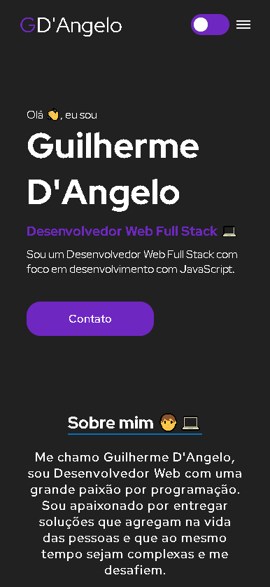

# Meu Portfólio com React

## Visão Geral

Esse projeto reúne minhas habilidades, competências, qualificações e experiências profissionais e feito totalmente do zero por mim.

### Resultado

[Clique aqui para acessar o meu portfólio](https://meu-portfolio-phi-six.vercel.app)

### Design Responsivo

A aplicação também foi feita para ser funcionar e ser responsiva em diversas resoluções, incluindo celulares

## Meu processo de criação 

### Feito com:

- ReactJS - O framework utilizada.
- Styled Components - A biblioteca utilizada, para estilizar o portfólio.
- TypeScript - A linguagem de programação principal.

 

## Autor

- Github - [Guilherme D'Angelo](https://github.com/Guilherme-DAngelo)
- Linkedin - [Guilherme D'Angelo](https://www.linkedin.co
